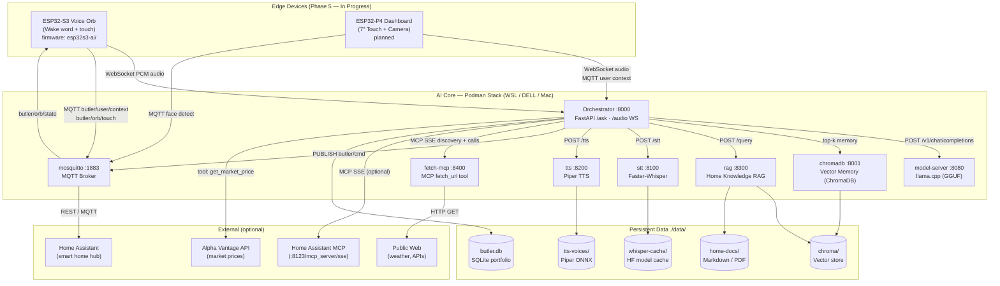
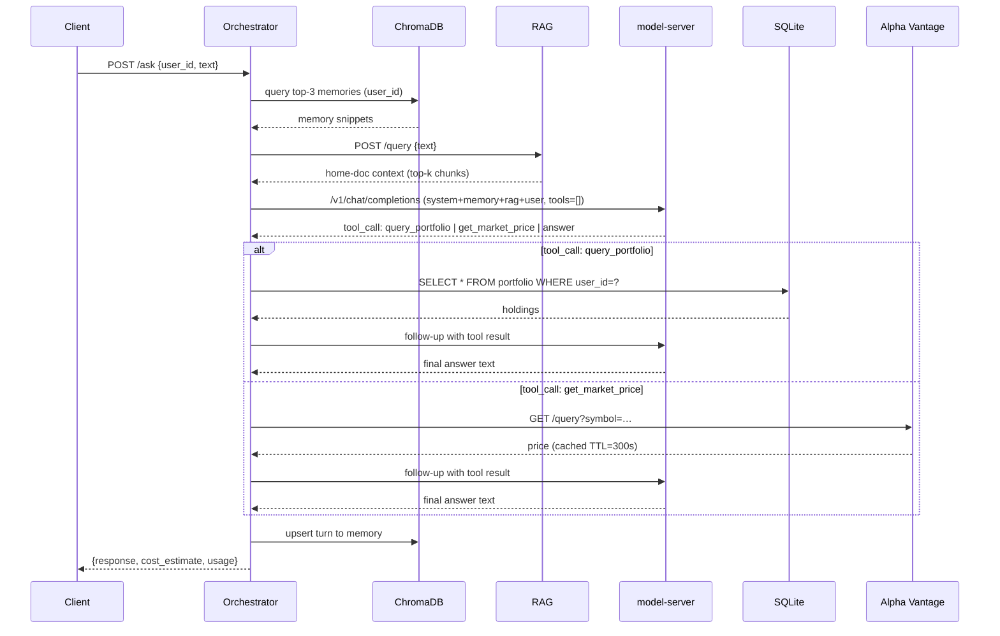
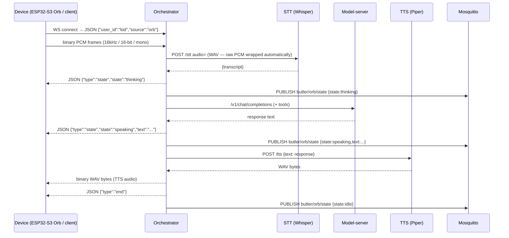
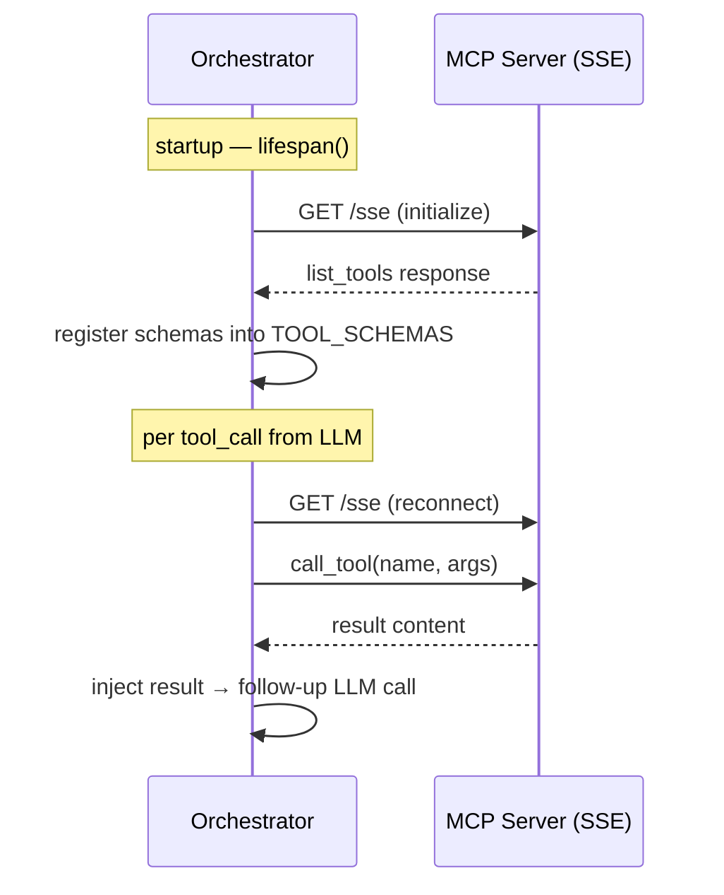
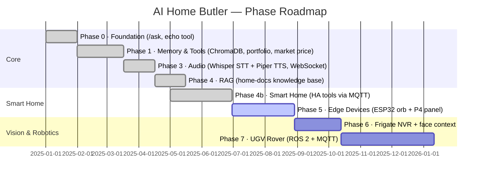

# AI Home Butler

A local AI assistant stack running entirely on your own hardware.
Text in → model reasons → tools execute → answer out. No cloud required.

**Current phase**: Phase 5 in progress — ESP32-S3 Voice Orb + Edge Devices.

---

## Architecture



---

## Request Flows

### HTTP `/ask` — Text request



### WebSocket `/audio` — Voice round-trip



---

## Services

| Service | Image | Port | Purpose |
|---------|-------|------|---------|
| `model-server` | `ghcr.io/ggml-org/llama.cpp:server-cuda` | 8080 | OpenAI-compat LLM inference |
| `orchestrator` | `localhost/ai-home-butler_orchestrator` | 8000 | FastAPI — `/ask` HTTP, `/audio` WebSocket |
| `chromadb` | `chromadb/chroma:latest` | 8001 | Vector memory store (top-k=3 retrieval) |
| `stt` | `localhost/ai-home-butler_stt`<br>*(base: `nvidia/cuda:13.3.0-runtime-ubuntu26.04`)* | 8100 | Faster-Whisper speech-to-text (GPU via `WHISPER_DEVICE=cuda`) |
| `tts` | `localhost/ai-home-butler_tts` | 8200 | Piper text-to-speech (WAV out) |
| `rag` | `localhost/ai-home-butler_rag` | 8300 | Home knowledge RAG (ChromaDB + ONNX) |

All persistent data lives in `./data/` and survives container restarts.

---

## Quick Start

```bash
# 1. Copy and fill in your secrets
cp .env.example .env
# edit .env — set ALPHA_VANTAGE_KEY (free key: https://www.alphavantage.co/support/#api-key)

# 2. Boot the stack (first run builds the orchestrator image)
podman-compose up --build -d

# 3. Wait for startup (ChromaDB ONNX model loads on first boot, ~30 s)
podman logs -f ai-home-butler_orchestrator_1
# Ready when: "Application startup complete."

# 4. Smoke test
curl -s http://127.0.0.1:8000/health
curl -s -X POST http://127.0.0.1:8000/ask \
  -H 'Content-Type: application/json' \
  -d '{"user_id":"default","text":"How is our AAPL position?"}' \
  | python3 -m json.tool
```

Expected response:
```json
{
    "user_id": "default",
    "response": "You hold 10 shares of AAPL ...",
    "cost_estimate": 0.0000xx,
    "usage": { "prompt_tokens": ..., "completion_tokens": ... }
}
```

---

## Environment Variables

Copy `.env.example` to `.env` and adjust:

| Variable | Default | Description |
|----------|---------|-------------|
| `MODEL_FILE` | `Qwen3.5-2B-Q4_K_M.gguf` | GGUF model filename (in `../models/`) |
| `N_GPU_LAYERS` | `99` | GPU layers (`0` = CPU-only, `99` = all layers) |
| `MAX_TOKENS` | `1024` | Max completion tokens (must be ≥ 1024 for Qwen3) |
| `ALPHA_VANTAGE_KEY` | *(empty)* | Free market price API key — required for `get_market_price` |
| `PRICE_CACHE_TTL` | `300` | Market price cache TTL in seconds |
| `IN_RATE_PER_1M` | `25.0` | Cost tracking: input token rate (credits/1M) |
| `OUT_RATE_PER_1M` | `200.0` | Cost tracking: output token rate (credits/1M) |
| `WHISPER_MODEL` | `tiny` | Faster-Whisper model size (`tiny`, `base`, `small`, `medium`) |
| `KV_CACHE_TYPE` | `f16` | llama.cpp KV cache precision (`f16`, `q8_0`, `q4_0`); use `q4_0` on P1000 for ctx ≥ 16K |
| `WHISPER_DEVICE` | `cpu` | STT inference device (`cpu` or `cuda`); set `cuda` on DELL P1000 |
| `WHISPER_COMPUTE` | `int8` | STT compute type (`int8` for CPU, `float16` for CUDA) |
| `VOICE_NAME` | `en_US-lessac-medium` | Piper voice; must be in `_VOICE_BASE_URLS` in `tts/main.py` |

---

## Available Tools

The orchestrator exposes native tools (registered in `tools.py`) plus any tools discovered from MCP servers at startup:

| Tool | Type | Source | Notes |
|------|------|--------|-------|
| `query_portfolio(user_id)` | native | `./data/butler.db` SQLite | Holdings; seeded with AAPL/MSFT/GOOGL |
| `get_market_price(symbol)` | native | Alpha Vantage API | Cached `PRICE_CACHE_TTL` s; needs API key |
| `get_home_state(entity_ids)` | native | Home Assistant REST | Requires `HA_URL` + `HA_TOKEN` |
| `set_home_state(entity_id, state)` | native | Home Assistant REST | Controls lights, locks, switches |
| `schedule_reminder(message, when_iso)` | native | SQLite + TTS | Fires spoken reminder at due time |
| `query_home_knowledge(query)` | native | RAG service `:8300` | Searches `data/home-docs/` |
| `detect_object(camera)` | native | Frigate NVR | Phase 6 — vision |
| `patrol_room(room)` | native | MQTT `butler/ugv/navigate` | Phase 7 — robotics |
| `fetch_url(url)` | **MCP** | `fetch-mcp :8400` | Real-time web content |
| *(any HA MCP tool)* | **MCP** | HA built-in MCP server | See MCP section below |

Tool schemas are passed to the model via the OpenAI `tools` parameter. The model picks the right tool; the orchestrator validates the name before executing.

---

## MCP Integration

The stack uses [Model Context Protocol (MCP)](https://modelcontextprotocol.io) to extend the butler's tool set without modifying `tools.py`. Any MCP server that speaks the SSE transport can be added.

### How it works



### Default MCP server: `fetch-mcp`

Included in the stack at `mcp-servers/fetch/`. Provides one tool:

| Tool | Description |
|------|-------------|
| `fetch_url(url, max_chars?)` | Fetch the body of any public URL (weather, APIs, docs) |

Example prompt that uses it:
```
"What's the weather in Stockholm right now?"
→ model calls fetch_url("https://wttr.in/Stockholm?format=3")
→ returns "Stockholm: ⛅  +18°C"
```

### Adding Home Assistant MCP (built-in since HA 2024.11)

Home Assistant ships a native MCP server. Point the butler at it with:

```bash
# .env
HA_URL=http://homeassistant.local:8123
HA_TOKEN=<long-lived-access-token>

# Add to MCP_SERVERS (comma-separated, no spaces)
MCP_SERVERS=http://fetch-mcp:8400,http://homeassistant.local:8123/mcp_server
MCP_TOKENS=,<same-long-lived-access-token>   # first entry blank = fetch-mcp needs no auth
```

The orchestrator will automatically discover all entities HA exposes as MCP tools (call_service, get_state, etc.) and make them available to the model.

### Adding any other MCP server

1. Run the server (Docker/Podman or `npx`) so it's reachable from the orchestrator container.
2. Append its SSE base-URL to `MCP_SERVERS` in `.env`.
3. If it requires a Bearer token, append it to `MCP_TOKENS` (keep position aligned).
4. `podman-compose up --build -d orchestrator` to reconnect.

Popular community servers:

| Server | npm package | What it adds |
|--------|------------|--------------|
| Filesystem | `@modelcontextprotocol/server-filesystem` | Read/write local files |
| Brave Search | `@modelcontextprotocol/server-brave-search` | Web search (needs Brave API key) |
| SQLite | `@modelcontextprotocol/server-sqlite` | Direct SQL on any `.db` file |
| Memory | `@modelcontextprotocol/server-memory` | Persistent key-value memory graph |

Run them as containers (example for `server-filesystem`):
```bash
podman run -d --name mcp-fs \
  -v ./data/home-docs:/docs:ro \
  -p 8401:8401 \
  node:22-slim \
  npx -y @modelcontextprotocol/server-filesystem /docs --sse-port 8401
# then add http://mcp-fs:8401 to MCP_SERVERS in .env
```

---

## Data Layout

```
data/
├── butler.db          SQLite — portfolio table (WAL mode)
│                      Seeded: AAPL×10 @ $150, MSFT×5 @ $300, GOOGL×2 @ $2500
├── chroma/            ChromaDB persistent storage (per-user conversation memory)
├── onnx-cache/        ChromaDB ONNX embedding model — downloaded once, persisted here
├── whisper-cache/     Faster-Whisper model cache (HF_HOME mount)
└── tts-voices/        Piper ONNX voice model — downloaded on first TTS service start
```

---

## Useful Commands

```bash
# Rebuild only the orchestrator (model-server stays running)
podman-compose up --build -d orchestrator

# Follow live logs
podman logs -f ai-home-butler_orchestrator_1

# Tear down (data/volumes preserved)
podman-compose down

# Tear down AND wipe all data
podman-compose down && rm -rf data/butler.db data/chroma data/onnx-cache

# Test market price tool directly
curl -s -X POST http://127.0.0.1:8000/ask \
  -H 'Content-Type: application/json' \
  -d '{"user_id":"default","text":"What is the current price of MSFT?"}'

# Inspect the SQLite portfolio
sqlite3 data/butler.db "SELECT * FROM portfolio;"

# Run all smoke tests (Phases 0, 1, 3)
bash smoke_test.sh
```

---

## Home Assistant Integration

### 1. Setup (.env)

```bash
# Use the LAN IP — containers can't resolve mDNS .local hostnames
HA_URL=http://192.168.1.98:8123          # native REST tools (get_home_state / set_home_state)
HA_TOKEN=<long-lived-access-token>       # HA → Profile → Long-Lived Access Tokens

MCP_SERVERS=http://fetch-mcp:8400,http://192.168.1.98:8123/mcp_server
MCP_TOKENS=,<same-long-lived-access-token>
#           ^ first slot empty = fetch-mcp needs no auth
```

Then restart the orchestrator:
```bash
podman-compose up -d orchestrator
```

---

### 2. Verify the MCP connection

```bash
# Should list all 22+ HA MCP tools at startup
podman logs ai-home-butler_orchestrator_1 2>&1 | grep -i mcp
```

Expected output:
```
INFO mcp_client mcp_connected url=http://192.168.1.98:8123/mcp_server tools=['HassTurnOn', 'HassTurnOff', 'GetLiveContext', ...]
INFO mcp_client mcp_tools_discovered total=23
```

---

### 3. Available HA MCP tools

These are auto-discovered from your HA instance at startup:

| Tool | What it does |
|------|-------------|
| `GetLiveContext` | **Read** — returns current state of all exposed entities (lights, sensors, media players, etc.) |
| `GetDateTime` | **Read** — current date and time from HA |
| `HassTurnOn` | **Control** — turn on any entity (light, switch, media player…) |
| `HassTurnOff` | **Control** — turn off any entity |
| `HassMediaPause` | **Media** — pause a media player |
| `HassMediaUnpause` | **Media** — resume a media player |
| `HassMediaNext` | **Media** — skip to next track |
| `HassMediaPrevious` | **Media** — go back to previous track |
| `HassSetVolume` | **Media** — set volume (0–100) |
| `HassSetVolumeRelative` | **Media** — increase/decrease volume by a step |
| `HassMediaPlayerMute` | **Media** — mute a media player |
| `HassMediaPlayerUnmute` | **Media** — unmute a media player |
| `HassMediaSearchAndPlay` | **Media** — search and play media by name |
| `HassVacuumStart` | **Vacuum** — start a robot vacuum |
| `HassVacuumReturnToBase` | **Vacuum** — send vacuum home |
| `HassVacuumCleanArea` | **Vacuum** — clean a specific area |
| `HassBroadcast` | **Announce** — broadcast a TTS message to speakers |
| `HassListAddItem` | **To-do** — add an item to a to-do list |
| `HassListCompleteItem` | **To-do** — mark a to-do item as done |
| `HassListRemoveItem` | **To-do** — remove a to-do item |
| `todo_get_items` | **To-do** — read all items from a to-do list |

---

### 4. Test queries — reading state

```bash
# What is happening at home right now?
curl -s -X POST http://localhost:8000/ask \
  -H 'Content-Type: application/json' \
  -d '{"user_id":"default","text":"What is the current state of my home?"}' \
  | python3 -m json.tool

# What time is it according to HA?
curl -s -X POST http://localhost:8000/ask \
  -H 'Content-Type: application/json' \
  -d '{"user_id":"default","text":"What time is it?"}' \
  | python3 -m json.tool

# Read to-do list
curl -s -X POST http://localhost:8000/ask \
  -H 'Content-Type: application/json' \
  -d '{"user_id":"default","text":"What is on my to-do list?"}' \
  | python3 -m json.tool

# Check a specific sensor (use the entity id from HA)
curl -s -X POST http://localhost:8000/ask \
  -H 'Content-Type: application/json' \
  -d '{"user_id":"default","text":"What is the temperature in the living room?"}' \
  | python3 -m json.tool
```

---

### 5. Test queries — controlling devices

> **Tip**: HA entity IDs follow the pattern `domain.name`, e.g. `light.living_room`, `switch.coffee_maker`, `media_player.bedroom_speaker`. Find yours in HA → Developer Tools → States.

```bash
# Turn a light on/off
curl -s -X POST http://localhost:8000/ask \
  -H 'Content-Type: application/json' \
  -d '{"user_id":"default","text":"Turn on the living room light"}' \
  | python3 -m json.tool

curl -s -X POST http://localhost:8000/ask \
  -H 'Content-Type: application/json' \
  -d '{"user_id":"default","text":"Turn off all the lights"}' \
  | python3 -m json.tool

# Control media player
curl -s -X POST http://localhost:8000/ask \
  -H 'Content-Type: application/json' \
  -d '{"user_id":"default","text":"Pause the bedroom speaker"}' \
  | python3 -m json.tool

curl -s -X POST http://localhost:8000/ask \
  -H 'Content-Type: application/json' \
  -d '{"user_id":"default","text":"Set the living room speaker volume to 40%"}' \
  | python3 -m json.tool

# Broadcast a message to HA speakers
curl -s -X POST http://localhost:8000/ask \
  -H 'Content-Type: application/json' \
  -d '{"user_id":"default","text":"Announce that dinner is ready on all speakers"}' \
  | python3 -m json.tool

# To-do list
curl -s -X POST http://localhost:8000/ask \
  -H 'Content-Type: application/json' \
  -d '{"user_id":"default","text":"Add buy milk to my shopping list"}' \
  | python3 -m json.tool
```

---

### 6. Watch the tool calls live

Run this in a second terminal while sending queries to see exactly which tool the model picks and what it returns:

```bash
podman logs -f ai-home-butler_orchestrator_1 2>&1 | grep -E "tool_call|dispatch|mcp_call|INFO|WARNING"
```

A successful HA tool call looks like:
```
INFO     tools      dispatch tool=HassTurnOn args={'entity_id': 'light.living_room'}
INFO     httpx      HTTP Request: POST http://192.168.1.98:8123/mcp_server/messages/... "HTTP/1.1 200 OK"
```

---

### 7. Troubleshooting

| Symptom | Cause | Fix |
|---------|-------|-----|
| `mcp_connect_failed … Connection refused` | Wrong HA IP | Use `http://192.168.1.98:8123` not `homeassistant.local` |
| `mcp_connect_failed … 401` | Bad token | Regenerate token in HA → Profile → Long-Lived Access Tokens |
| `mcp_tools_discovered total=0` | MCP Server integration not configured | HA → Settings → Integrations → Model Context Protocol Server → Configure → select entities/areas to expose |
| Tool called but HA ignores it | Entity not exposed to MCP | In HA MCP integration config, add the entity's area or entity_id to the allow list |
| Butler says "I can't control that" | Entity name in prompt doesn't match HA name | Ask "What devices do I have?" first to see exact names |

---

## Audio (Phase 3)

### Service health checks
```bash
curl http://127.0.0.1:8100/health   # STT — {"status":"ok","model":"tiny"}
curl http://127.0.0.1:8200/health   # TTS — {"status":"ok","voice":"en_US-lessac-medium"}
```

### Test TTS directly (text → WAV file)
```bash
curl -s -X POST http://127.0.0.1:8200/tts \
  -H 'Content-Type: application/json' \
  -d '{"text": "Hello, I am your home butler."}' \
  -o /tmp/butler.wav
aplay /tmp/butler.wav   # or: ffplay -nodisp -autoexit /tmp/butler.wav
```

### Test STT directly (WAV file → transcript)
```bash
# Record a short clip first (requires arecord)
arecord -d 3 -f cd /tmp/test.wav
curl -s -X POST http://127.0.0.1:8100/stt \
  -F 'audio=@/tmp/test.wav' | python3 -m json.tool
```

### WebSocket audio round-trip
```bash
# Requires: pip install websockets
python3 - <<'EOF'
import asyncio, websockets, pathlib, json

async def test():
    uri = "ws://127.0.0.1:8000/audio"
    wav = pathlib.Path("/tmp/test.wav").read_bytes()  # your WAV file
    async with websockets.connect(uri) as ws:
        # Send config frame first
        await ws.send(json.dumps({"user_id": "default", "source": "test"}))
        await ws.send(wav)
        # Receive frames: JSON state frames, then binary TTS audio, then {"type":"end"}
        response_wav = b""
        while True:
            msg = await ws.recv()
            if isinstance(msg, str):
                frame = json.loads(msg)
                print(f"state frame: {frame}")
                if frame.get("type") == "end":
                    break
            else:
                response_wav = msg
        pathlib.Path("/tmp/response.wav").write_bytes(response_wav)
        print(f"Received {len(response_wav)} bytes of TTS audio")

asyncio.run(test())
EOF
aplay /tmp/response.wav
```

### Model size guide

| `WHISPER_MODEL` | Size | WSL speed | Notes |
|-----------------|------|-----------|-------|
| `tiny` | 77 MB | ~5–10× real-time | Default — fast, good enough for home use |
| `base` | 145 MB | ~3–5× | Better accuracy |
| `small` | 466 MB | ~1–2× | Slow on CPU; use on GPU |
| `medium` | 1.5 GB | <1× | GPU only |

Set in `.env`: `WHISPER_MODEL=base`  (restart stt container to take effect)

## ESP32-S3 Voice Orb (Phase 5)

The Voice Orb is a [Waveshare ESP32-S3-Touch-LCD-1.85](https://www.waveshare.com/wiki/ESP32-S3-Touch-LCD-1.85) — a 360×360 round touch display with built-in WiFi that sits on the desk and lets the family interact with Butler by voice or touch. The firmware is in `esp32s3-ai/`. Full design documentation is in [`.github/instructions/esp32s3-orb.md`](.github/instructions/esp32s3-orb.md).

### Face expressions

The round display shows a StackChan-inspired animated face that reflects the current state:

| State | Face | Accent ring |
|-------|------|-------------|
| IDLE | Slow blink every ~3.5 s, soft smile, pupils drift | Blue `#4488FF` |
| LISTENING | Wide eyes, small "O" mouth | Green `#44FF88` |
| THINKING | Pupils scan left ↔ right, closed mouth | Amber `#FFAA00` |
| SPEAKING | Mouth arc driven by PCM RMS amplitude | Cyan `#00CCFF` |
| ERROR | Left eye squinted, frown | Red `#FF4444` |
| CONNECTING | Half-closed eyes | Grey `#888888` |

Status bar (top): live clock from PCF85063 RTC, WiFi icon, battery level.

### Build & flash

```bash
# 1. Copy hardware drivers from the reference project (required — not in registry)
cd /path/to/ai-home-butler
mkdir -p esp32s3-ai/components
cp -r .github/reference/esp32-s3-round-lcd/components/esp_lcd_st77916 esp32s3-ai/components/
# Copy peripheral driver sources from reference main/ into components/:
for drv in LCD_Driver LVGL_Driver Touch_Driver Audio_Driver MIC_Driver \
            I2C_Driver BAT_Driver PWR_Key PCF85063 QMI8658; do
  cp -r .github/reference/esp32-s3-round-lcd/main/${drv} esp32s3-ai/components/
done

# 2. Build & flash
cd esp32s3-ai
. $HOME/esp/esp-idf/export.sh      # ESP-IDF v5.3+
idf.py set-target esp32s3
idf.py menuconfig                   # AI Orb Configuration → fill in values below
idf.py build
idf.py -p /dev/ttyUSB0 flash monitor
```

Key settings under **AI Orb Configuration** in `menuconfig`:

| Setting | Example |
|---------|---------|
| WiFi SSID / Password | your home network |
| Orchestrator Host IP | `192.168.1.10` — WSL: run `hostname -I` to find it |
| Orchestrator WS Port | `8000` |
| MQTT Broker Host | same as orchestrator |
| User ID | `kid` (used in `butler/user/context` MQTT messages) |
| Wake Word Model | `wn9_hilexin` (say "Hi Lexin" to wake) |

> **Important**: use the host machine's **LAN IP**, not `127.0.0.1`. The ESP32 is a physical LAN device and cannot reach localhost.

### How voice works end-to-end

```
[Say "Hi Lexin" or tap screen]
        ↓  MQTT: butler/user/context {user_id:kid, source:orb}
[Orb streams PCM → ws://HOST:8000/audio]
        ↓  Orchestrator wraps PCM → WAV, calls STT
[Orchestrator sends {"type":"state","state":"thinking"}]
        ↓  Face: pupils scan left/right (amber ring)
[Orchestrator calls LLM, calls tools if needed]
[Orchestrator sends {"type":"state","state":"speaking","text":"..."}]
        ↓  Face: mouth ready (cyan ring)
[Orchestrator sends WAV bytes (TTS audio)]
        ↓  Orb plays audio; mouth arc driven by PCM RMS
[Orchestrator sends {"type":"end"}  →  MQTT: butler/orb/state {state:idle}]
        ↓  Face: back to idle blink (blue ring)
```

### MQTT topics

| Topic | Direction | Example payload |
|-------|-----------|----------------|
| `butler/user/context` | Orb → Server | `{"user_id":"kid","source":"orb","action":"wake"}` |
| `butler/orb/touch` | Orb → Server | `{"type":"tap","ts":1234567890}` |
| `butler/orb/state` | Server → Orb | `{"state":"thinking","text":"","emotion":""}` |

Monitor MQTT live:
```bash
# from the host (requires mosquitto-clients)
mosquitto_sub -h 127.0.0.1 -p 1883 -t 'butler/#' -v
```

### Troubleshooting

| Symptom | Cause | Fix |
|---------|-------|-----|
| `WS connect failed` in serial monitor | Wrong orchestrator IP/port | Check `menuconfig` → Orchestrator Host; use LAN IP from `hostname -I` |
| Orb connects but STT returns empty | Silent audio / wrong mic pin | Verify `PIN_MIC_DIN` in `board.h`; check mic wiring |
| Face stuck on CONNECTING | WiFi wrong | Re-run `menuconfig`, check SSID/password, reflash |
| Mouth doesn't animate | SPEAKING state not reached | Check `podman logs orchestrator` for `orb_state state=speaking` |
| MQTT topics not received | Broker unreachable from ESP32 | Port 1883 must be open on host LAN interface; check firewall |

---

## Build Roadmap



| Phase | Status | Goal |
|-------|--------|------|
| 0 — Foundation | ✓ Done | `/ask` endpoint, one tool, smoke test |
| 1 — Memory & Tools | ✓ Done | ChromaDB memory, portfolio + market price tools, cost tracking |
| 3 — Audio | ✅ Done | Whisper STT + Piper TTS over WebSocket |
| 4 — RAG | ✅ Done | Home knowledge base, auto-indexes `data/home-docs/` |
| 4b — Smart Home | ✅ Done | Home Assistant native + MCP tools; MQTT smart home control |
| 5 — Edge Devices | 🔧 Active | ESP32-S3 Voice Orb firmware scaffold in `esp32s3-ai/`; orb → orchestrator wiring in progress |
| 6 — Vision | Planned | Frigate NVR, face-detect context piped via MQTT |
| 7 — Robotics | Planned | UGV Rover (ROS 2), mobile speaker + camera |
| 2 — DELL Migration | Deferred (after Phase 6) | Deploy complete tested stack to DELL — `.env` change only |
| 7 — Mac Mini | Planned | Final migration to Docker + M4 Metal |

See [`.github/instructions/roadmap.md`](../.github/instructions/roadmap.md) for full task lists.

---

## Knowledge Base (Phase 4)

Butler indexes `.txt` and `.md` files from `data/home-docs/` on startup and
makes them searchable via the `query_home_knowledge` tool.

### Add documents
```bash
# Drop any text/markdown file — it's indexed automatically on next restart
cp ~/my-appliance-manual.txt data/home-docs/
podman-compose restart rag
```

### Query the knowledge base directly
```bash
curl -s -X POST http://127.0.0.1:8300/v1/query \
  -H 'Content-Type: application/json' \
  -d '{"query": "how do I reset the dishwasher?", "top_k": 3}' \
  | python3 -m json.tool
```

### Index a document without restarting
```bash
curl -s -X POST http://127.0.0.1:8300/v1/index \
  -H 'Content-Type: application/json' \
  -d '{"source": "note.txt", "content": "The WiFi password is posted on the fridge."}' \
  | python3 -m json.tool
```

### Check chunk count
```bash
curl -s http://127.0.0.1:8300/health
# {"status": "ok", "chunks": 12}
```

Butler automatically calls `query_home_knowledge` when you ask about home-related topics.

